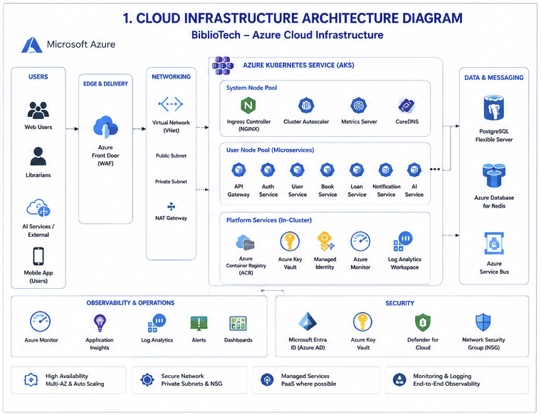
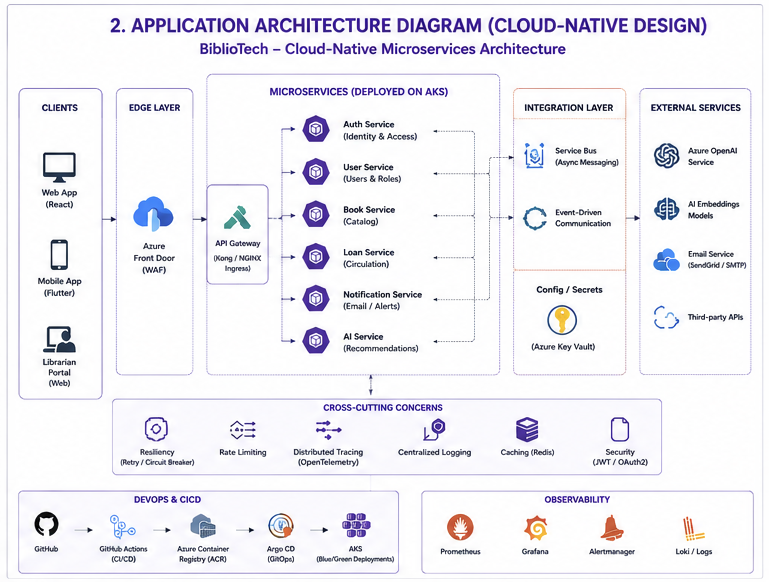
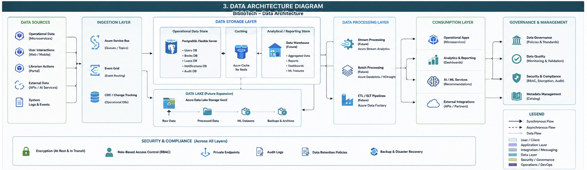

# Arquitectura — Patrones de Diseño, SOLID y Mejoras — BiblioTech

> **Fecha:** 2026-06-01
> **Alcance:** Frontend (React 19), .NET 10 Identity API, Node.js Catalog Service, Node.js Chatbot Service
> **Objetivo:** Documentar la aplicación actual de patrones de diseño, principios SOLID y mejoras implementadas en todo el codebase.

---

## Tabla de Contenidos

1. [Arquitectura Empresarial y Cloud-Native](#1-arquitectura-empresarial-y-cloud-native)
2. [Resumen de Implementación](#2-resumen-de-implementación)
3. [Principios SOLID](#3-principios-solid)
4. [Patrones de Diseño](#4-patrones-de-diseño)
5. [Frontend — Mejoras Específicas](#5-frontend--mejoras-específicas)
6. [Backend .NET — Mejoras Específicas](#6-backend-net--mejoras-específicas)
7. [Backend Node.js — Mejoras Específicas](#7-backend-nodejs--mejoras-específicas)
8. [Cross-Cutting Concerns](#8-cross-cutting-concerns)

---
## 1. Arquitectura Empresarial y Cloud-Native

La solución BiblioTech fue diseñada siguiendo principios de arquitectura cloud-native, microservicios, desacoplamiento mediante mensajería asíncrona y observabilidad centralizada.

La plataforma se despliega sobre Microsoft Azure utilizando Azure Kubernetes Service (AKS) como plataforma de orquestación de contenedores, permitiendo escalabilidad horizontal, alta disponibilidad y automatización de despliegues.

---

## 1.1 Cloud Infrastructure Architecture Diagram

La siguiente arquitectura representa la infraestructura cloud donde operan los servicios de BiblioTech.

### Componentes de Infraestructura

| Componente                     | Propósito                          |
| ------------------------------ | ---------------------------------- |
| Azure Front Door               | Entrada principal y protección WAF |
| Azure Kubernetes Service (AKS) | Orquestación de contenedores       |
| Azure Container Registry       | Almacenamiento de imágenes Docker  |
| Azure Key Vault                | Gestión de secretos y claves       |
| Azure Database for PostgreSQL  | Persistencia de datos              |
| Azure Cache for Redis          | Caché distribuido                  |
| Azure Service Bus              | Comunicación asíncrona             |
| Azure Monitor                  | Observabilidad y monitoreo         |

### Características Arquitectónicas

* Alta disponibilidad multi-zona.
* Escalamiento automático mediante AKS.
* Seguridad basada en Zero Trust.
* Gestión centralizada de secretos.
* Monitoreo y observabilidad end-to-end.
* Preparada para despliegues Blue-Green.

---

## 1.2 Application Architecture Diagram (Cloud-Native Design)

La arquitectura de aplicaciones sigue una estrategia de microservicios independientes con responsabilidades claramente delimitadas.

### Frontend

#### React 19

Responsable de:

* Gestión de catálogo.
* Administración de usuarios.
* Panel administrativo.
* Chatbot inteligente.
* Experiencia de usuario.

---

### Backend Services

#### Identity Service (.NET 10)

Funciones:

* Autenticación JWT.
* Gestión de usuarios.
* Gestión de roles.
* Refresh Tokens.
* Seguridad y autorización.

#### Catalog Service (Node.js)

Funciones:

* Gestión de libros.
* Catálogo bibliográfico.
* Recomendaciones.
* CQRS.
* Publicación de eventos.

#### Chatbot Service (Node.js)

Funciones:

* Asistente virtual.
* Recuperación contextual.
* Integración con IA.
* Recomendaciones inteligentes.

---

### Integración

Los servicios se comunican mediante:

* Azure Service Bus.
* Redis Streams.
* Eventos de dominio.
* APIs REST.

---

### Capacidades Cloud-Native

* CQRS.
* Outbox Pattern.
* Circuit Breaker.
* Retry Policies.
* Correlation IDs.
* Distributed Logging.
* Metrics Collection.
* OpenAPI.

---

## 1.3 Data Architecture Diagram

La arquitectura de datos describe el ciclo completo de almacenamiento, procesamiento y consumo de información.

### Fuentes de Datos

* Usuarios.
* Roles.
* Libros.
* Préstamos.
* Conversaciones del chatbot.
* Servicios externos.
* Modelos de IA.

---

### Persistencia Operacional

#### PostgreSQL

Bases de datos principales:

* Users
* Roles
* Books
* Loans
* Notifications
* Refresh Tokens

---

### Capa de Caché

#### Redis

Utilizado para:

* Cache de consultas.
* Redis Streams.
* Optimización de rendimiento.
* Sesiones distribuidas.

---

### Capa de Integración

#### Azure Service Bus

Permite:

* Comunicación desacoplada.
* Arquitectura orientada a eventos.
* Publicación y consumo de eventos.
* Integración entre microservicios.

---

### Analítica y Evolución Futura

La arquitectura contempla una futura evolución hacia:

* Data Warehouse.
* Data Lake.
* Dashboards ejecutivos.
* Machine Learning.
* Analítica avanzada.

---

### Gobierno y Seguridad

La plataforma implementa:

* RBAC.
* Auditoría.
* Data Governance.
* Data Quality.
* Backup & Recovery.
* Gestión de Metadatos.

## 2. Resumen de Implementación

### ✅ 27 patrones y principios implementados — 0 pendientes

| # | Patrón / Principio | Dónde | Estado |
|---|-------------------|-------|--------|
| 1 | **SRP — Capas .NET** | Api/Application/Infrastructure/Domain | ✅ |
| 2 | **SRP — Hooks React** | `useChatbot`, `useAiRecommendations`, `useBookForm`, `useAuth` | ✅ |
| 3 | **TanStack Query** | `useBooksQuery`, `useUsersQuery`, `useRolesQuery` | ✅ |
| 4 | **Error Boundary** | `ErrorBoundary.jsx` | ✅ |
| 5 | **Refresh Tokens** | .NET — tabla `refresh_tokens`, endpoint `/api/auth/refresh` | ✅ |
| 6 | **Dapper** | Migración raw SQL en .NET repos | ✅ |
| 7 | **Observabilidad** | pino + prom-client + AsyncLocalStorage | ✅ |
| 8 | **Outbox Pattern** | `OutboxEvent` + `outbox-processor` worker | ✅ |
| 9 | **OpenAPI / Swagger** | Catalog API + Chatbot API + Identity API | ✅ |
| 10 | **Circuit Breaker + Retry** | `biblioteca-shared` usado por AuthHttpClient y AiService | ✅ |
| 11 | **Result Pattern** | `Result<T>` en .NET | ✅ |
| 12 | **Tests unitarios** | 13 archivos: 5 xUnit + 3 Vitest frontend + 3 Vitest catalog + 1 chatbot + 1 shared | ✅ |
| 13 | **Azure Key Vault** | JWT Key via DefaultAzureCredential | ✅ |
| 14 | **CORS** | Limitado por método/header en producción | ✅ |
| 15 | **AbortController** | `AuthContext` + `auth.api.js` — cancelación de requests | ✅ |
| 16 | **TF-IDF** | `RetrievalEngine` con `natural` (TfIdf + WordTokenizer + pesos por campo) | ✅ |
| 17 | **CatalogContextService seguro** | Token por request, no por estado mutable | ✅ |
| 18 | **Mediator (MediatR)** | Queries de usuarios .NET | ✅ |
| 19 | **Specification Pattern** | Filtros componibles en .NET | ✅ |
| 20 | **CQRS** | `BookQueryController` + `BookCommandController` en catalog-service | ✅ |
| 21 | **Decorator** | `composeMiddleware()` en biblioteca-shared | ✅ |
| 22 | **Facade** | `IBookRecommender` + `AiService` como fachada unificada | ✅ |
| 23 | **Chain of Responsibility** | `AiProviderHandler` en chatbot (Gemini → Groq → OpenRouter → Local) | ✅ |
| 24 | **State Machine** | `UserStateMachine` en .NET Domain | ✅ |
| 25 | **Strategy** | `AiProviderRegistry` en chatbot | ✅ |
| 26 | **Observer** | `BookEventBus` + `MessagingObserver` + `LoggingObserver` | ✅ |
| 27 | **Proxy / Adapter** | `AuthHttpClient` con cache de 5s | ✅ |

---

## 3. Principios SOLID

### S — Single Responsibility Principle (SRP)

> *Una clase o módulo debe tener una única razón para cambiar.*

**✅ Implementado:**

| Archivo | Evidencia |
|---------|-----------|
| .NET Identity API | Separación limpia en capas — Api (controllers), Application (services), Infrastructure (repos, security), Domain (entities) |
| `CatalogPage.jsx` | Hook `useAiRecommendations` extraído a `src/hooks/useAiRecommendations.js` |
| `AdminPage.jsx` | Fragmentado en tabs: `BooksTab`, `UsersTab`, `RolesTab` (~127 líneas) |
| `ChatbotWidget.jsx` | Hook `useChatbot` extraído a `src/hooks/useChatbot.js`. Widget solo renderiza |
| `BookForm.jsx` | Hook `useBookForm` extraído a `src/hooks/useBookForm.js`. Componente solo renderiza |
| `ai.service.js` | Delega en 4 providers: `RetrievalEngine`, `HuggingFaceProvider`, `LocalFallbackProvider`, `ExplanationBuilder` |
| `messaging.service.js` | Delega en 3 clases: `ServiceBusConnectionManager`, `EventPublisher`, `EventConsumer` |
| `env.js` (catalog) | Validación separada en `validate-env.js` |

### O — Open/Closed Principle (OCP)

> *Las entidades de software deben estar abiertas para la extensión, pero cerradas para la modificación.*

**✅ Implementado:**

| Archivo | Evidencia |
|---------|-----------|
| `BookEventBus` + observers | Catálogo emite eventos sin saber quién los escucha. Nuevos observers se agregan sin tocar los controllers |
| `chatbot.service.js` | `AiProviderRegistry` con providers (`GeminiProvider`, `GroqProvider`, `OpenRouterProvider`) que implementan `ask()` |
| `AuthController.cs` | `ICookieOptionsFactory` inyectado. Cookie options centralizadas |
| `env.js` (ambos servicios) | Validación con `zod` (`z.object()`) |

### L — Liskov Substitution Principle (LSP)

> *Los objetos de una clase hija deben poder sustituir a objetos de la clase padre sin alterar la corrección del programa.*

**✅ Implementado:**

| Componente | Evidencia |
|------------|-----------|
| `createAuthMiddleware` | Re-exportado desde `biblioteca-shared` |
| `createErrorMiddleware` | Re-exportado desde `biblioteca-shared` |
| `correlationIdMiddleware` | Usado en catalog-service y chatbot-service |
| `CircuitBreaker` | Compartido desde `biblioteca-shared`, usado por `AuthHttpClient` y `AiService` |
| `asyncContext` | `AsyncLocalStorage` para correlationId |

### I — Interface Segregation Principle (ISP)

> *Ningún cliente debe depender de métodos que no usa.*

**✅ Estado actual:**

| Archivo | Notas |
|---------|-------|
| `IUserRepository.cs` | Bien segregada. Para tamaño actual está bien |
| `AuthContext.jsx` | `contextValue` solo expone: `user`, `loading`, `login`, `logout`, `isAuthenticated`, `hasRole` |
| Controllers | Auth/Users/Roles son archivos separados en .NET. Catálogo separa book-crud y book-ai |

### D — Dependency Inversion Principle (DIP)

> *Las abstracciones no deben depender de los detalles. Los detalles deben depender de las abstracciones.*

**✅ Implementado:**

| Archivo | Evidencia |
|---------|-----------|
| .NET DI | Inyección nativa con `builder.Services.AddScoped<>()`. Controllers dependen de abstracciones (`IUserRepository`) |
| `book.service.js` | `constructor(bookRepository)` — recibe `IBookRepository`. `app.js` inyecta `SequelizeBookRepository` |
| `ai.service.js` | Constructor recibe `{ retrievalEngine, huggingFaceProvider, localFallbackProvider, explanationBuilder }` |
| `chatbot.service.js` | `constructor(catalogContext, providerRegistry)`. `app.js` inyecta ambas |
| `catalog-context.service.js` | `CatalogApiClient` inyectado vía constructor |
| `auth.service.js` (catalog) | `AuthHttpClient` inyectado. Factory `createAuthService()` compone `AuthHttpClient` + `AuthService` |

---

## 4. Patrones de Diseño

### Ya aplicados

| Patrón | Dónde | Comentario |
|--------|-------|------------|
| **Repository** | .NET (`IUserRepository`, `IRoleRepository`) | Permite cambiar PostgreSQL por otro motor |
| **Singleton** | `BookEventBus` | Uso correcto con `static instance` |
| **Observer** | `BookEventBus` + `MessagingObserver` + `LoggingObserver` | Buena desacoplación de eventos del catálogo |
| **Strategy** | `AiProviderRegistry` en chatbot | Providers implementan `ask()`. `ChatbotService` itera el registro |
| **Dependency Injection** | .NET `Program.cs` | Nativo y bien usado |
| **Factory** | `PostgresConnectionStringFactory` | Útil y generalizable |
| **Rate Limiting / Throttle** | `express-rate-limit` | 100/15min general, 30/hr AI, 50/hr chat |
| **Correlation ID** | Middleware + AsyncLocalStorage | Traza distribuida en todos los logs |
| **Builder** | `ApiResponseBuilder` en catalog-service | `success()`, `paginated()`, `empty()` estáticos |
| **Result (functional)** | `Result<T>` en .NET | Evita excepciones como control de flujo |
| **Circuit Breaker** | `biblioteca-shared/src/circuit-breaker.js` | Compartido entre AuthHttpClient y AiService |
| **Retry with Exponential Backoff** | `AuthHttpClient.introspect()` | 3 reintentos: 200ms, 400ms, 800ms |
| **Proxy / Adapter** | `AuthHttpClient` (cache 5s) | Evita llamadas repetidas a Identity |
| **Chain of Responsibility** | `AiProviderHandler` en chatbot | Gemini → Groq → OpenRouter → fallback local |
| **State Machine** | `UserStateMachine` en .NET Domain | Transiciones: Pending→Active, Active→Suspended/Deactivated |
| **Outbox / Transactional Outbox** | `OutboxEvent` + `outbox-processor` | Eventos de libro en misma transacción SQL |
| **OpenAPI / Swagger** | Catalog + Chatbot + Identity | Documentación interactiva |
| **Mediator** | Queries de usuarios (.NET) | `MediatR` con `GetAllUsersQuery` y `GetUserByIdQuery` |
| **Specification** | Filtros de usuarios (.NET) | `Specification<T>` base. `UserByStatusSpecification`, `UserByRoleSpecification`, `UserBySearchSpecification` |
| **Command / CQRS** | `BookQueryController` + `BookCommandController` | Queries (GET) y commands (POST/PUT/DELETE/PATCH) separados |
| **Decorator** | `composeMiddleware()` en biblioteca-shared | Envuelve middleware Express de forma declarativa |
| **Facade** | `AiService` implements `IBookRecommender` | Fachada unificada sobre 4 providers + circuit breaker |

---

## 5. Frontend — Mejoras Específicas

### Arquitectura de Componentes

| Problema | Solución |
|----------|----------|
| Smart component gigante (`AdminPage.jsx`) | ✅ Fragmentado en `BooksTab`, `UsersTab`, `RolesTab` |
| Lógica de formulario en UI (`BookForm.jsx`) | ✅ `useBookForm()` extraído. Componente solo renderiza |
| Chatbot sin custom hook (`ChatbotWidget.jsx`) | ✅ `useChatbot()` creado. Widget solo renderiza |
| Polling / re-fetch manual (`useBooks.js` legacy) | ✅ `useBooks.js` eliminado. Toda la app usa TanStack Query |
| Sin Error Boundary | ✅ `ErrorBoundary.jsx` creado y en uso |
| Magic numbers/strings | ✅ Constantes centralizadas en `app.constants.js` y `chat.constants.js` |
| Sin lazy loading | ✅ `React.lazy()` + `<Suspense>` en rutas pesadas |

### Axios / API Layer

| Problema | Solución |
|----------|----------|
| 5 archivos repiten config | ✅ `createApiClient(baseURL)` centraliza todo |
| correlationId singleton mutable | ✅ `AsyncLocalStorage` en backend. Logs incluyen correlationId |
| Sin cancelación de requests | ✅ `AbortController` en `AuthContext` y `login()` |

---

## 6. Backend .NET — Mejoras Específicas

### Arquitectura y SOLID

| Problema | Solución |
|----------|----------|
| `PostgresUserRepository` raw SQL verboso | ✅ Migrado a **Dapper** |
| `BindingFlags` + `SetValue` para Id | ✅ Eliminado. Id por constructor/factory |
| `JwtTokenService.ValidateToken()` catch sin log | ✅ `ILogger<JwtTokenService>` inyectado |
| `AuthController.Login` retorna token en body | ✅ Solo cookie httpOnly |
| Sin refresh tokens | ✅ Tabla `refresh_tokens`, endpoint `/api/auth/refresh` |

### Patrones implementados

| Patrón | Implementación |
|--------|---------------|
| **Result Pattern** | `Result<T>` en `MiniIdentityApi.Application.Common` |
| **Mediator (MediatR)** | Queries `GetAllUsersQuery` + `GetUserByIdQuery` con handlers |
| **Specification Pattern** | `Specification<T>` base. Filtros componibles con &, \|, ! |

---

## 7. Backend Node.js — Mejoras Específicas

### Catalog Service

| Problema | Solución |
|----------|----------|
| `BookService` + `AiService` estáticos | ✅ Ambos son instancias con DI |
| `AiService` monolítico | ✅ Delega en `RetrievalEngine`, `HuggingFaceProvider`, `LocalFallbackProvider`, `ExplanationBuilder` |
| Scoring manual | ✅ **TF-IDF** con `natural`. Pesos: title=3.0, category=2.5, author=1.5, description=1.0 |
| `MessagingService` estado global | ✅ Constructor sin defaults |
| `AZURE_SERVICE_BUS_CONNECTION_STRING` required | ✅ Opcional — se desactiva automáticamente |
| Sin circuit breaker en AI calls | ✅ `CircuitBreaker` compartido (3 fallos, reset 30s) |

### Chatbot Service

| Problema | Solución |
|----------|----------|
| `askGemini`, `askGroq`, `askOpenRouter` funciones sueltas | ✅ Clases `GeminiProvider`, `GroqProvider`, `OpenRouterProvider` con `ask()` |
| `ChatbotService.answer()` itera providers | ✅ `AiProviderHandler` con Chain of Responsibility |
| `buildSystemPrompt` string concatenado | ✅ Función pura con parámetros `{ user, catalogContext }` |
| `RedisStreamService` estático | ✅ Convertido a instancia |
| `CatalogContextService` token mutable | ✅ Token por request en `getAvailableBooks(page, limit, accessToken)` |

---

## 8. Cross-Cutting Concerns

### Seguridad

| Problema | Riesgo | Solución |
|----------|--------|----------|
| JWT Key en `appsettings.json` | Crítico | ✅ Vacío en código. Clave vía env var o Azure Key Vault |
| JWT expira en 1h sin refresh | Alto | ✅ Refresh tokens implementados |
| Token en body login | Alto | ✅ Solo cookie httpOnly |
| Sin retry en servicios Node.js | Medio | ✅ Circuit breaker + retry exponencial + cache 5s |
| CORS permisivo | Medio | ✅ Métodos y headers limitados |

### Testing

| Problema | Solución |
|----------|----------|
| Pocos tests | ✅ **13 archivos**: 5 xUnit (.NET) + 3 Vitest (frontend) + 3 Vitest (catalog) + 1 Vitest (chatbot) + 1 Vitest (shared) |
| Métodos estáticos dificultan mocking | ✅ Todos los servicios son instancias inyectables |
| Sin contratos de API | ✅ Swagger/OpenAPI 3.0 en todos los servicios |

### Observabilidad

| Problema | Solución | Estado |
|----------|----------|--------|
| `console.log` en servicios Node.js | ✅ Migrado a `pino` | ✅ |
| Sin métricas | ✅ `/metrics` con `prom-client` (Histogram + collectDefaultMetrics) | ✅ |
| correlationId no logueado | ✅ `AsyncLocalStorage` en biblioteca-shared. Logger wrapper inyecta correlationId | ✅ |

---

> **BiblioTech** — Proyecto académico — Universidad de los Llanos  
> Ingeniería de Sistemas | Mayo 2026
