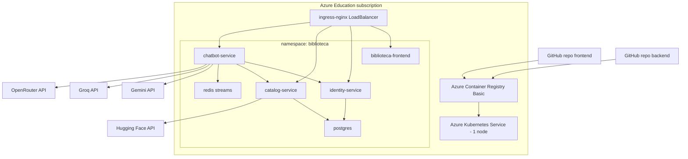

# Guia paso a paso: AKS en Azure Education

Esta guia usa `Central US` y `Standard_B2pls_v2`, porque esa combinacion ya te aparecio disponible para VM y suele funcionar mejor que `B2s` para un cluster AKS con ingress, PostgreSQL, Redis Streams y tres APIs.

Objetivo:

- Crear AKS + ACR cuidando creditos.
- Desplegar backend y frontend por separado.
- Redesplegar solo el servicio que cambie.
- Pausar o borrar recursos al terminar.

---

## Arquitectura objetivo



---

## Repositorios separados

Este workspace contiene los dos proyectos ya separados por carpeta:

```text
Biblioteca-Frontend/
biblioteca-microservicios/
```

Para publicarlos como repos independientes:

```powershell
# Frontend repo
git subtree split --prefix=Biblioteca-Frontend -b frontend-main
git push https://github.com/TU_USUARIO/biblioteca-frontend.git frontend-main:main

# Backend repo
git subtree split --prefix=biblioteca-microservicios -b backend-main
git push https://github.com/TU_USUARIO/biblioteca-backend-microservicios.git backend-main:main
```

Tambien puedes copiar cada carpeta a su propio repositorio nuevo. No copies `.env` con secretos.

---

## Despliegue actual verificado

Este entorno ya quedo desplegado y probado en Azure Education:

```powershell
$RESOURCE_GROUP="rg-biblioteca-aks-edu"
$AKS_NAME="aks-biblioteca-edu"
$ACR_NAME="acrbibliotecaedu"
$ACR_LOGIN_SERVER="acrbibliotecaedu.azurecr.io"
$INGRESS_IP="172.169.130.237"
$TAG="aks-20260522-031612"
```

URL publica de demo:

```text
https://bibliotechu.duckdns.org
```

---

## 0. Costos y decision antes de crear

AKS consume credito principalmente por:

- Nodos del cluster: `Standard_B2pls_v2` mientras el cluster esta encendido.
- Discos administrados para PVCs de PostgreSQL y Redis.
- Public IP y Load Balancer del ingress.
- Azure Container Registry Basic.

Para cuidar creditos:

- Usa `NodeCount 1`.
- Usa `--tier free` en AKS.
- Deten el cluster apenas termines la demo.
- Borra el Resource Group si ya no lo necesitas.
- No dejes `ingress-nginx` corriendo durante dias si no vas a usarlo.

Comandos de ahorro:

```powershell
.\azure\aks-stop.ps1 -ResourceGroup "rg-biblioteca-aks-edu" -AksName "aks-biblioteca-edu"
.\azure\aks-start.ps1 -ResourceGroup "rg-biblioteca-aks-edu" -AksName "aks-biblioteca-edu"
.\azure\aks-delete-resource-group.ps1 -ResourceGroup "rg-biblioteca-aks-edu" -ConfirmDelete
```

`az aks stop` detiene el cobro de computo de los nodos cuando queda en estado `Stopped`, pero pueden quedar costos pequenos por discos, ACR, IP o recursos asociados. Para cortar todo, elimina el Resource Group.

---

## 1. Requisitos locales

Instala:

- Azure CLI.
- Docker Desktop.
- kubectl.
- Helm.

En Windows puedes instalar Helm con:

```powershell
winget install Helm.Helm
```

Verifica:

```powershell
az version
docker version
kubectl version --client
helm version
```

Inicia sesion:

```powershell
az login
az account show --output table
```

---

## 2. Crear AKS + ACR

Usa nombres en minuscula para ACR. El nombre de ACR debe ser unico globalmente.

```powershell
.\azure\create-aks-education.ps1 `
  -ResourceGroup "rg-biblioteca-aks-edu" `
  -Location "centralus" `
  -AcrName "acrbibliotecaedu" `
  -AksName "aks-biblioteca-edu" `
  -NodeVmSize "Standard_B2pls_v2" `
  -NodeCount 1 `
  -InstallIngressNginx
```

Si Azure dice que el nombre del ACR ya existe, cambia el sufijo:

```text
acrbibliotecaedu456
```

Si Azure Education bloquea la region o la SKU, prueba:

```powershell
az vm list-skus `
  --location centralus `
  --size Standard_B2pls_v2 `
  --all `
  --output table
```

---

## 3. Obtener variables del cluster

```powershell
$RESOURCE_GROUP="rg-biblioteca-aks-edu"
$AKS_NAME="aks-biblioteca-edu"
$ACR_NAME="acrbibliotecaedu"
$ACR_LOGIN_SERVER = az acr show -g $RESOURCE_GROUP -n $ACR_NAME --query loginServer -o tsv

az aks get-credentials -g $RESOURCE_GROUP -n $AKS_NAME --overwrite-existing
kubectl get nodes
```

Obtiene la IP publica del ingress:

```powershell
$INGRESS_IP = kubectl get svc ingress-nginx-controller -n ingress-nginx -o jsonpath="{.status.loadBalancer.ingress[0].ip}"
$INGRESS_IP
```

Si sale vacio, espera 1 o 2 minutos y repite.

---

## 4. Build y push backend

```powershell
cd biblioteca-microservicios

$TAG="v1"
az acr login --name $ACR_NAME

docker build -t "$ACR_LOGIN_SERVER/biblioteca/identity-service:$TAG" .\mini-identity-api-dotnet-main\mini-identity-api-dotnet-main
docker build -t "$ACR_LOGIN_SERVER/biblioteca/catalog-service:$TAG" .\catalog-service
docker build -t "$ACR_LOGIN_SERVER/biblioteca/chatbot-service:$TAG" .\chatbot-service

docker push "$ACR_LOGIN_SERVER/biblioteca/identity-service:$TAG"
docker push "$ACR_LOGIN_SERVER/biblioteca/catalog-service:$TAG"
docker push "$ACR_LOGIN_SERVER/biblioteca/chatbot-service:$TAG"
```

---

## 5. Crear secretos backend

Reemplaza los valores por tus claves reales. Si no usas Azure Service Bus, dejalo vacio.

```powershell
kubectl create namespace biblioteca --dry-run=client -o yaml | kubectl apply -f -

kubectl create secret generic biblioteca-secrets `
  --namespace biblioteca `
  --from-literal=POSTGRES_PASSWORD="postgres123" `
  --from-literal=HF_API_TOKEN="hf_xxx" `
  --from-literal=GEMINI_API_KEY="gemini_xxx" `
  --from-literal=GROQ_API_KEY="groq_xxx" `
  --from-literal=OPENROUTER_API_KEY="openrouter_xxx" `
  --from-literal=AZURE_SERVICE_BUS_CONNECTION_STRING="" `
  --dry-run=client -o yaml | kubectl apply -f -
```

---

## 6. Desplegar backend en Kubernetes

Para demo sin dominio, usa el overlay `aks-no-domain`.

```powershell
kubectl apply -k k8s/overlays/aks-no-domain
```

Actualiza CORS y OpenRouter Referer con la IP publica:

```powershell
$patchFile = New-TemporaryFile
("{""data"":{""CORS_ORIGINS"":""http://$INGRESS_IP"",""OPENROUTER_REFERER"":""http://$INGRESS_IP""}}") |
  Set-Content -Path $patchFile -Encoding ascii
kubectl patch configmap biblioteca-config -n biblioteca --type merge --patch-file $patchFile
Remove-Item -LiteralPath $patchFile -Force
```

Actualiza imagenes:

```powershell
kubectl set image deployment/identity-service `
  identity-service="$ACR_LOGIN_SERVER/biblioteca/identity-service:$TAG" `
  -n biblioteca

kubectl set image deployment/catalog-service `
  catalog-service="$ACR_LOGIN_SERVER/biblioteca/catalog-service:$TAG" `
  -n biblioteca

kubectl set image deployment/chatbot-service `
  chatbot-service="$ACR_LOGIN_SERVER/biblioteca/chatbot-service:$TAG" `
  -n biblioteca
```

Espera rollouts:

```powershell
kubectl rollout status deployment/postgres -n biblioteca --timeout=420s
kubectl rollout status deployment/rabbitmq -n biblioteca --timeout=420s
kubectl rollout status deployment/identity-service -n biblioteca --timeout=420s
kubectl rollout status deployment/catalog-service -n biblioteca --timeout=420s
kubectl rollout status deployment/chatbot-service -n biblioteca --timeout=240s
```

---

## 7. Build y push frontend

Vuelve a la raiz y compila el frontend apuntando al mismo ingress por IP:

```powershell
cd ..\Biblioteca-Frontend

docker build `
  --build-arg VITE_AUTH_SERVICE_URL="http://$INGRESS_IP" `
  --build-arg VITE_CATALOG_SERVICE_URL="http://$INGRESS_IP" `
  --build-arg VITE_CHATBOT_SERVICE_URL="http://$INGRESS_IP" `
  -t "$ACR_LOGIN_SERVER/biblioteca/frontend:$TAG" .

docker push "$ACR_LOGIN_SERVER/biblioteca/frontend:$TAG"
```

---

## 8. Desplegar frontend

```powershell
kubectl apply -k k8s/overlays/aks-no-domain

kubectl set image deployment/biblioteca-frontend `
  frontend="$ACR_LOGIN_SERVER/biblioteca/frontend:$TAG" `
  -n biblioteca

kubectl rollout status deployment/biblioteca-frontend -n biblioteca --timeout=180s
```

Abre:

```text
http://INGRESS_IP
```

Ejemplo:

```powershell
Start-Process "http://$INGRESS_IP"
```

---

## 9. Verificar despliegue

```powershell
kubectl get pods -n biblioteca
kubectl get ingress -n biblioteca
kubectl get svc -n biblioteca
```

Health checks:

```powershell
Invoke-RestMethod "http://$INGRESS_IP/health"
Invoke-RestMethod "http://$INGRESS_IP/api/catalog/health"
Invoke-RestMethod "http://$INGRESS_IP/api/chatbot/health"
```

Logs:

```powershell
kubectl logs deployment/identity-service -n biblioteca --tail=80
kubectl logs deployment/catalog-service -n biblioteca --tail=80
kubectl logs deployment/chatbot-service -n biblioteca --tail=80
```

Redis Streams:

```powershell
kubectl exec deployment/redis -n biblioteca -- redis-cli XLEN chatbot_events
```

Prueba real del chatbot con token:

```powershell
$base = "http://$INGRESS_IP"
$login = Invoke-RestMethod `
  -Method Post `
  -Uri "$base/api/auth/login" `
  -ContentType "application/json" `
  -Body (@{ usernameOrEmail = "admin"; password = "admin" } | ConvertTo-Json)

$token = $login.token

Invoke-RestMethod `
  -Method Post `
  -Uri "$base/api/chatbot/messages" `
  -ContentType "application/json" `
  -Headers @{ Authorization = "Bearer $token" } `
  -Body (@{ message = "Recomiendame un libro de arquitectura de software"; history = @() } | ConvertTo-Json -Depth 5)
```

---

## 10. DNS e ingress (con DuckDNS + Let's Encrypt)

El dominio configurado es `bibliotechu.duckdns.org` con certificado SSL via cert-manager.

### Configurar certificados

```powershell
.\azure\setup-ssl.ps1
```

Actualiza el registro DNS con la IP publica del ingress:

```powershell
.\azure\update-dns.ps1
```

### Verificar certificados

```powershell
kubectl get certificate -n biblioteca
kubectl describe certificate bibliotechu-backend-tls -n biblioteca
kubectl describe certificate bibliotechu-frontend-tls -n biblioteca
```

Los overlays `aks-no-domain` usan IP directa sin dominio. Para produccion se recomienda usar el overlay `aks/` con dominio y SSL.

---

## 11. Recuperar rollout atascado

En Azure Education con un solo nodo, un rollout puede atascarse si Kubernetes intenta mantener pods viejos y nuevos al mismo tiempo. Sintomas:

- `Insufficient cpu`.
- `ImagePullBackOff` en ReplicaSets antiguos con `biblioteca/*:latest`.
- Postgres no inicia por `lost+found` en Azure Disk.
- RabbitMQ arranca pero un probe agresivo lo reinicia.

Los manifiestos ya incluyen:

- `strategy: Recreate` para backend.
- `PGDATA=/var/lib/postgresql/data/pgdata` en Postgres.
- Probes mas tolerantes para RabbitMQ, Identity, Catalog y Chatbot.

Si el rollout queda atascado, limpia los pods problemáticos y reaplica:

```powershell
kubectl -n biblioteca scale deployment/postgres deployment/rabbitmq deployment/identity-service deployment/catalog-service deployment/chatbot-service --replicas=0

foreach ($app in @("postgres","rabbitmq","identity-service","catalog-service","chatbot-service")) {
  kubectl -n biblioteca wait --for=delete pod -l "app=$app" --timeout=180s
}

kubectl apply -k .\biblioteca-microservicios\k8s\overlays\aks-no-domain

kubectl set image deployment/identity-service identity-service="$ACR_LOGIN_SERVER/biblioteca/identity-service:$TAG" -n biblioteca
kubectl set image deployment/catalog-service catalog-service="$ACR_LOGIN_SERVER/biblioteca/catalog-service:$TAG" -n biblioteca
kubectl set image deployment/chatbot-service chatbot-service="$ACR_LOGIN_SERVER/biblioteca/chatbot-service:$TAG" -n biblioteca

kubectl rollout status deployment/postgres -n biblioteca --timeout=420s
kubectl rollout status deployment/rabbitmq -n biblioteca --timeout=420s
kubectl rollout status deployment/identity-service -n biblioteca --timeout=420s
kubectl rollout status deployment/catalog-service -n biblioteca --timeout=420s
kubectl rollout status deployment/chatbot-service -n biblioteca --timeout=240s
```

---

## 12. Redesplegar cambios

### Solo chatbot

```powershell
cd ..\biblioteca-microservicios
$TAG="chatbot-v2"

docker build -t "$ACR_LOGIN_SERVER/biblioteca/chatbot-service:$TAG" .\chatbot-service
docker push "$ACR_LOGIN_SERVER/biblioteca/chatbot-service:$TAG"

kubectl set image deployment/chatbot-service `
  chatbot-service="$ACR_LOGIN_SERVER/biblioteca/chatbot-service:$TAG" `
  -n biblioteca

kubectl rollout status deployment/chatbot-service -n biblioteca --timeout=180s
```

### Solo catalog

```powershell
$TAG="catalog-v2"
docker build -t "$ACR_LOGIN_SERVER/biblioteca/catalog-service:$TAG" .\catalog-service
docker push "$ACR_LOGIN_SERVER/biblioteca/catalog-service:$TAG"
kubectl set image deployment/catalog-service catalog-service="$ACR_LOGIN_SERVER/biblioteca/catalog-service:$TAG" -n biblioteca
kubectl rollout status deployment/catalog-service -n biblioteca --timeout=180s
```

### Solo identity

```powershell
$TAG="identity-v2"
docker build -t "$ACR_LOGIN_SERVER/biblioteca/identity-service:$TAG" .\mini-identity-api-dotnet-main\mini-identity-api-dotnet-main
docker push "$ACR_LOGIN_SERVER/biblioteca/identity-service:$TAG"
kubectl set image deployment/identity-service identity-service="$ACR_LOGIN_SERVER/biblioteca/identity-service:$TAG" -n biblioteca
kubectl rollout status deployment/identity-service -n biblioteca --timeout=180s
```

### Solo frontend

```powershell
cd ..\Biblioteca-Frontend
$TAG="frontend-v2"

docker build `
  --build-arg VITE_AUTH_SERVICE_URL="http://$INGRESS_IP" `
  --build-arg VITE_CATALOG_SERVICE_URL="http://$INGRESS_IP" `
  --build-arg VITE_CHATBOT_SERVICE_URL="http://$INGRESS_IP" `
  -t "$ACR_LOGIN_SERVER/biblioteca/frontend:$TAG" .

docker push "$ACR_LOGIN_SERVER/biblioteca/frontend:$TAG"
kubectl set image deployment/biblioteca-frontend frontend="$ACR_LOGIN_SERVER/biblioteca/frontend:$TAG" -n biblioteca
kubectl rollout status deployment/biblioteca-frontend -n biblioteca --timeout=180s
```

---

## 13. Rollback

Si un deploy falla:

```powershell
kubectl rollout undo deployment/chatbot-service -n biblioteca
kubectl rollout undo deployment/catalog-service -n biblioteca
kubectl rollout undo deployment/identity-service -n biblioteca
kubectl rollout undo deployment/biblioteca-frontend -n biblioteca
```

Ver historial:

```powershell
kubectl rollout history deployment/chatbot-service -n biblioteca
```

---

## 14. Detener para ahorrar creditos

Cuando termines la demo:

```powershell
cd ..
.\azure\aks-stop.ps1 -ResourceGroup "rg-biblioteca-aks-edu" -AksName "aks-biblioteca-edu"
```

Verifica estado:

```powershell
.\azure\aks-status.ps1 -ResourceGroup "rg-biblioteca-aks-edu" -AksName "aks-biblioteca-edu"
```

Para volver a usarlo:

```powershell
.\azure\aks-start.ps1 -ResourceGroup "rg-biblioteca-aks-edu" -AksName "aks-biblioteca-edu"
```

Despues de iniciar, la IP del ingress podria cambiar. Si cambia, reconstruye frontend con la nueva IP y actualiza CORS:

```powershell
$INGRESS_IP = kubectl get svc ingress-nginx-controller -n ingress-nginx -o jsonpath="{.status.loadBalancer.ingress[0].ip}"
```

---

## 15. Borrar todo si ya termino la entrega

Esta es la opcion mas segura para no gastar creditos:

```powershell
.\azure\aks-delete-resource-group.ps1 `
  -ResourceGroup "rg-biblioteca-aks-edu" `
  -ConfirmDelete
```

Confirma en Azure Portal que el Resource Group desaparecio.

---

## 16. Configurar GitHub Actions

Cada repo necesita estas variables:

```text
AKS_RESOURCE_GROUP=rg-biblioteca-aks-edu
AKS_CLUSTER_NAME=aks-biblioteca-edu
ACR_NAME=acrbibliotecaedu
ACR_LOGIN_SERVER=acrbibliotecaedu.azurecr.io
PUBLIC_BASE_URL=https://bibliotechu.duckdns.org
```

Ambos repos necesitan este secret:

```text
AZURE_CREDENTIALS
```

Puedes generarlo con:

```powershell
$SUBSCRIPTION_ID = az account show --query id -o tsv
az ad sp create-for-rbac `
  --name "sp-biblioteca-github" `
  --role Contributor `
  --scopes "/subscriptions/$SUBSCRIPTION_ID/resourceGroups/rg-biblioteca-aks-edu" `
  --sdk-auth
```

Copia el JSON completo como secret `AZURE_CREDENTIALS`.

---

## 17. Checklist final de demo

Antes de presentar:

```powershell
kubectl get nodes
kubectl get pods -n biblioteca
kubectl get ingress -n biblioteca
Invoke-RestMethod "http://$INGRESS_IP/api/chatbot/health"
```

En la app:

1. Abrir `http://$INGRESS_IP`.
2. Login con `admin` / `admin`.
3. Abrir chatbot.
4. Preguntar por libros de arquitectura o microservicios.
5. Mostrar logs:

   ```powershell
   kubectl logs deployment/chatbot-service -n biblioteca --tail=120
   kubectl exec deployment/redis -n biblioteca -- redis-cli XLEN chatbot_events
   ```

---

## 18. Nota

El codigo y Dockerfiles permiten despliegue en cualquier plataforma de contenedores (Azure Container Apps, App Service, etc.) porque cada servicio esta contenerizado y desacoplado.

Para Azure Education se recomienda iniciar con ACR Basic, un nodo AKS y recursos pequenos.
